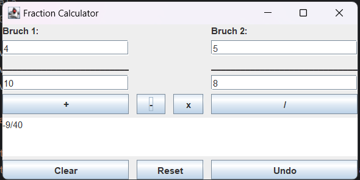
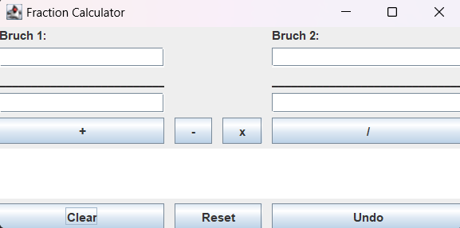
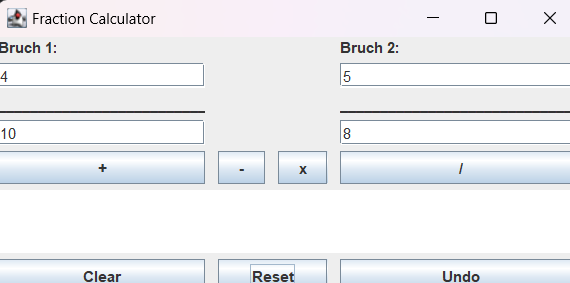
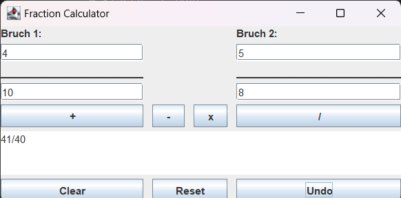

<a name="readme-top"></a>

# Fraction Calculator (Bruchrechner)

**Author:** Burim Shala <br>
**Schule:** LBS Eibiswald | 2aAPC

Dies ist eine Java-basierte Anwendung, die es ermöglicht, mit Bruchzahlen zu rechnen. Die Anwendung unterstützt die grundlegenden mathematischen Operationen wie **Addition**, **Subtraktion**, **Multiplikation** und **Division** von zwei Bruchzahlen.<br> Die Benutzeroberfläche wurde mit **Java Swing** erstellt, und das Ergebnis wird nach jeder Berechnung angezeigt.

## Funktionen:
- **Addition**: Zwei Brüche werden addiert.
- **Subtraktion**: Zwei Brüche werden voneinander subtrahiert.
- **Multiplikation**: Zwei Brüche werden miteinander multipliziert.
- **Division**: Ein Bruch wird durch einen anderen Bruch dividiert.
- **Reset-Button**: Die zuletzt berechneten Werte werden in die Eingabefelder zurückgesetzt.

## Installation:
Um die Anwendung lokal auszuführen, folge diesen Schritten:

### Voraussetzungen:
- **Java Development Kit (JDK)** installiert (Version 8 oder höher).
- Eine IDE wie **IntelliJ IDEA** oder **Eclipse**, um das Projekt zu öffnen und auszuführen.

### Schritte zur Installation:
1. Klone das Repository:
    ```bash
    git clone https://github.com/Burim2023/Berufsschule/new/main/Fraction_calculator_GUI
    ```

2. Öffne das Projekt in deiner bevorzugten IDE.

3. Führe die Datei `fractionCalculator.java` aus.

<p align="right">(<a href="#readme-top">back to top</a>)</p>

## Verwendung:
Technologien im Einsatz:
<a href="https://www.java.com" target="_blank" rel="noreferrer"> 
<p>Sobald die Anwendung gestartet ist, stehen die folgenden Funktionen zur Verfügung:</p>

### Brüche eingeben:
- Gib die Zähler und Nenner für beide Brüche ein.

### Rechenoperation auswählen:
- Wähle die gewünschte Rechenoperation (Addition, Subtraktion, Multiplikation, Division).
- Das Ergebnis der Berechnung wird im Ergebnisbereich angezeigt.

### Reset:
- Drücke den **Reset-Button**, um die zuletzt berechneten Werte in die Eingabefelder zurückzusetzen.
- 
### Undo:
- Drücke den **Undo-Button**, um das zuletzt berechneten Ergebnis in das Ausgabefeld zurückzusetzen.

### Clear:
- Drücke den **Clear-Button**, um alle Eingabe- und Ausgabefelder zu leeren.
<p align="right">(<a href="#readme-top">back to top</a>)</p>

## Projektstruktur

```plaintext
/src
   ├── fractionCalculator.java           # Hauptklasse für die Benutzeroberfläche
   ├── fractionCalculatorLogic.java      # Klasse mit der Berechnungslogik
/docs
   └── documentation.pdf                 # (Optional) PDF-Dokumentation
```
## Screenshots:









<p align="right">(<a href="#readme-top">back to top</a>)</p>

## Quellen:

- Java Documentation: [https://docs.oracle.com/en/java/](https://docs.oracle.com/en/java/)

- Swing-Tutorial: [https://docs.oracle.com/javase/tutorial/uiswing/](https://docs.oracle.com/javase/tutorial/uiswing/)

<p align="right">(<a href="#readme-top">back to top</a>)</p>
