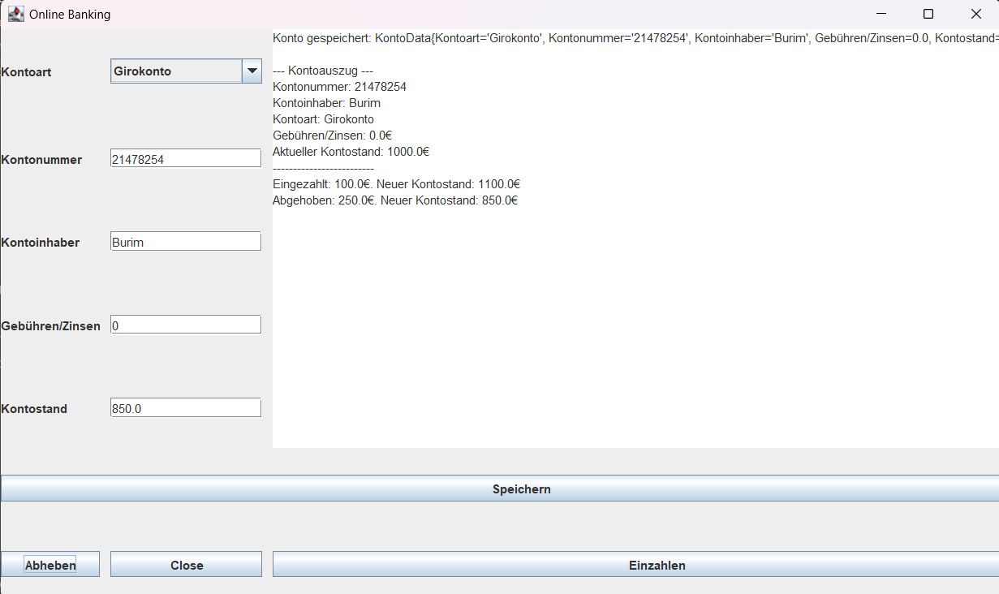
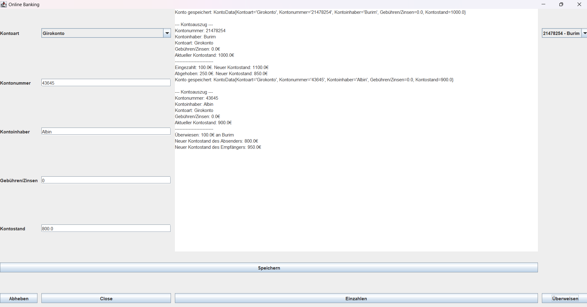

<a name="readme-top"></a>
# Online Banking Demo-Anwendung

Author: Burim Shala <br>
LBS Eibiswald | 2aAPC

Diese Anwendung simuliert eine einfache Online-Banking-Plattform, bei der Benutzer verschiedene Arten von Bankkonten verwalten und typische Bankgeschäfte wie Einzahlungen, Abhebungen und Überweisungen durchführen können. Zu den unterstützten Kontotypen gehören **Girokonto**, **Sparkonto** und **Kreditkonto**. Jedes Konto hat spezifische Regeln, wie z. B. Einschränkungen bei Überweisungen oder Abhebungen, abhängig vom Kontotyp.

## Funktionen:
- **Einzahlungen**: Geld wird dem Konto gutgeschrieben.
- **Abhebungen**: Geld wird vom Konto abgehoben (mit Einschränkungen je nach Kontotyp).
- **Überweisungen**: Geld kann zwischen verschiedenen Konten überwiesen werden (mit Kontostand-Überprüfung).
- **Kontoverwaltung**: Erstellen, Anzeigen und Verwalten von verschiedenen Konten.

## Kontotypen:
1. **Girokonto**: 
   - Überweisungen und Abhebungen sind erlaubt, solange das Konto ausreichend gedeckt ist.
   
2. **Sparkonto**: 
   - Abhebungen und Überweisungen sind erlaubt, jedoch darf das Konto nicht negativ werden.
   
3. **Kreditkonto**: 
   - Nur Einzahlungen sind erlaubt. Es können keine Abhebungen oder Überweisungen getätigt werden.

## Installation:
Um die Anwendung lokal auszuführen, folge diesen Schritten:

### Voraussetzungen:
- **Java Development Kit (JDK)** installiert (Version 8 oder höher).
- Eine IDE wie **IntelliJ IDEA** oder **Eclipse**, um das Projekt zu öffnen und auszuführen.

### Schritte zur Installation:
1. Klone das Repository:
    ```bash
    git clone https://github.com/Burim2023/Berufsschule/tree/main/Kontoverwaltung_Shala
    cd repository
    ```

2. Öffne das Projekt in deiner bevorzugten IDE.

3. Führe die Datei `onlineBanking.java` aus.

<p align="right">(<a href="#readme-top">back to top</a>)</p>

## Verwendung:
Sobald die Anwendung gestartet ist, stehen die folgenden Funktionen zur Verfügung:

### Konto erstellen:
- Wähle den Kontotyp aus (Girokonto, Sparkonto oder Kreditkonto).
- Gib die erforderlichen Kontoinformationen ein (Kontonummer, Kontoinhaber, Gebühren/Zinsen, anfänglicher Kontostand).
- Speichere das Konto.

### Einzahlen:
- Gib den Betrag ein, den du auf das Konto einzahlen möchtest.
- Der Kontostand wird aktualisiert und in der Transaktionshistorie angezeigt.

### Abheben:
- Abhängig vom Kontotyp kannst du Geld abheben.
- Sparkonten können nicht ins Minus gehen, Kreditkonten können keine Abhebungen tätigen.

### Überweisen:
- Wähle ein Zielkonto aus der Liste der gespeicherten Konten aus.
- Gib den Überweisungsbetrag ein.
- Der Kontostand des aktuellen Kontos und des Zielkontos wird nach erfolgreicher Überweisung aktualisiert.

<p align="right">(<a href="#readme-top">back to top</a>)</p>

## Screenshots:





<p align="right">(<a href="#readme-top">back to top</a>)</p>

## Kontotyp-spezifische Logik:
- **Girokonto**: Ermöglicht Überweisungen und Abhebungen, solange der Kontostand nicht negativ wird.
- **Sparkonto**: Ermöglicht Überweisungen und Abhebungen, darf jedoch nie einen negativen Kontostand haben.
- **Kreditkonto**: Es können nur Einzahlungen vorgenommen werden. Abhebungen und Überweisungen sind nicht möglich (in der aktuellen Version).

<p align="right">(<a href="#readme-top">back to top</a>)</p>

## Quellen:
- Java Documentation: [https://docs.oracle.com/en/java/](https://docs.oracle.com/en/java/)
- Swing-Tutorial: [https://docs.oracle.com/javase/tutorial/uiswing/](https://docs.oracle.com/javase/tutorial/uiswing/)

<p align="right">(<a href="#readme-top">back to top</a>)</p>
